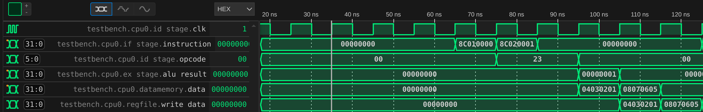
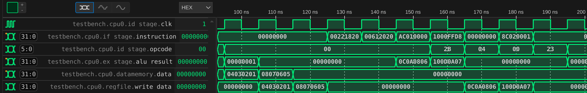

# 上机试验 2：流水线性能分析 II

## 实验平台

自己设计一个流水线模拟器（简称：模拟器 A）

## 设计思想

在学习了计算机体系结构的五级流水线后，我编写了一个基于verilog语言的MIPS 32位pipeline模拟器，可以实现基本的beqz,add,lw,sw功能，并使用在ID段添加分支控制来解决分支跳转，以及使用forwarding技术解决数据冲突，并保持时序正确性。

### 周期控制

在此pipeline模拟器中，我只在中间段寄存器中添加了时序控制。

```verilog
module IF2ID_register (
    input clk,
    input reset,
    input [31:0] instruction_in,
    input beq_taken,
    output reg [31:0] instruction_out
);

    always @(posedge clk or posedge reset) begin
        if (reset) begin
            instruction_out <= 32'b0; // Reset instruction to zero
        end else if(!beq_taken) begin
            instruction_out <= instruction_in; // Pass instruction
        end
            else if (beq_taken) begin
            instruction_out <= 32'b0; // If branch taken, reset instruction
        end
    end

endmodule   
```

### 分支控制

为了使得指令正常运行，我在ID段对beqz的结果进行判断，并将结果传出。
```verilog
 6'b000100: begin  // beqz
                if (rs_data == rt_data) begin
                    beq_taken = 1;
                    beq_imm   = imm_ext;
                end else begin
                    beq_taken = 0;
                    beq_imm   = 0;
                end
            end
```

在pc控制中我添加了branch_imm以及beq_taken信号来控制分支跳转。

```verilog
module PC(
    input clk,
    input reset,
    input [31:0] next_pc,  // 来自 IF 阶段的下一个 PC 值
    input beq_taken, // 分支指令是否被采取
    input [31:0] branch_imm, // 传入立即数
    output reg [31:0] pc_out // 输出当前 PC 值
);
    always @(*) begin
        if (reset) begin
            pc_out = 32'b0; // 重置 PC 值为 0
        end 
        else begin
        pc_out = next_pc; // 更新 PC 值
        if (beq_taken) begin
            pc_out = pc_out + branch_imm; // 如果分支被采取，跳转到分支目标地址
        end
         end
    end
endmodule
```

### 数据冲突解决

在ID段，我添加了数据冲突判断，如果存在RAW冲突，则进行forwarding操作。

注意如果RAW指令在add后发生，则在ex阶段前递，如果在lw指令后发生，则在mem阶段前递。


```verilog
        rs_data_temp = rs_data;
        rt_data_temp = rt_data;
        //在此没有考虑当add操作执行到mem阶段直接写入下一条指令的ID段的情况
        if (rs != 0) begin
            if (rs == ex_rd && ex_reg_write)
                rs_data_temp = ex_alu_result; 
            else if (rs == mem_rd && mem_reg_write)
                rs_data_temp = mem_data;
        end

        if (rd != 0) begin
            if (rd == ex_rd && ex_reg_write)
                rd_data_temp = ex_alu_result; 
            else if (rd == mem_rd && mem_reg_write)
                rd_data_temp = mem_data;
        end

                // load-use hazard 检测（EX阶段指令为lw，且当前ID使用该寄存器）
        if (ex_reg_write && ex_rd != 0 && mem_read) begin
            if ((rs == ex_rd) || ((rt == ex_rd) && opcode != 6'b101011)) begin
                stall = 1;
            end
        end
```

## 测试指令

```verilog
  memory[0] = 32'b000000_00000_00000_0000000000000000; // nope
  memory[1] = 32'b000000_00000_00000_0000000000000000; // nope
  memory[2] = 32'b000000_00000_00000_0000000000000000; // nope
  memory[3] = 32'b100011_00000_00001_0000000000000000; // lw x1,0(x0) 
  memory[4] = 32'b100011_00000_00010_0000000000000001; // lw x2,1(x0)
  memory[5] = 32'b000000_00000_00000_0000000000000000; // nope
  memory[6] = 32'b000000_00000_00000_0000000000000000; // nope
  memory[7] = 32'b000000_00000_00000_0000000000000000; // nope
  memory[8] = 32'b000000_00000_00000_0000000000000000; // nope
  memory[9] = 32'b000000_00001_00010_00011_00000100000; // add x3, x1, x2
  memory[10] = 32'b000000_00011_00001_00100_00000100000; // add x4, x3, x1
  memory[11] = 32'b101011_00000_00001_0000000000000000; // sw x1,0(x0)
  memory[12] = 32'b000100_00000_00000_1111111111011000; // beq $0, $0, -9
  memory[13] = 32'b000000_00000_00000_0000000000000000; // nope
```

 观察可得，前两条lw指令没有任何冲突，后面的两条add指令会发生RAW冲突，beq指令会进行分支跳转

 ## 功能掩饰

在此我使用instruction来代表IF段，opcode代表ID段，alu_result代码EX段，data代表mem段，write_data代表wb段。

### 没有任何冲突的流水线场景



观察可得，五级流水线正常运行。

### RAW冲突



指令分析可知，nope后的两条add指令会发生RAW冲突，但是在此流水线没有停顿，因为使用了forwarding技术使第一个add在ex段将运算结果流出。

### 分支跳转


观察指令可得，在执行beqz操作的时候产生了分支跳转，在此我的处理方法是在ID段添加了分支跳转判断，并将结果传入pc。

需要注意的是，由于是在ID段进行的跳转判断，所以这个周期会取出下一条不一定执行的语句，在此我进行了判断，如果beq_taken=1，则将IF2ID清空。

```verilog
module IF2ID_register (
    input clk,
    input reset,
    input [31:0] instruction_in,
    input beq_taken,
    output reg [31:0] instruction_out
);

    always @(posedge clk or posedge reset) begin
        if (reset) begin
            instruction_out <= 32'b0; // Reset instruction to zero
        end else if(!beq_taken) begin
            instruction_out <= instruction_in; // Pass instruction
        end
            else if (beq_taken) begin
            instruction_out <= 32'b0; // If branch taken, reset instruction
        end
    end

endmodule   
```

## 实验感悟

在编写五级流水线的过程中，我加深了对五级流水线和竞争的认识，熟悉了verilog编写的思想。


